# Laboratorio 1: Matriz de 100,000 x 100,000 en Disco Duro
**Materia**: Estructuras de Datos y Laboratorio  
Almacenamiento, indexación algebraica $O(1)$ y consulta eficiente de una matriz de **10 mil millones de celdas** ($100,000 \times 100,000$) en almacenamiento secundario (disco duro).

## Representación de la Matriz en Disco

A diferencia de implementaciones ingenuas que intentan cargar la matriz entera en RAM o escribirla celda por celda, este proyecto modela una **estructura binaria compacta con acceso directo en almacenamiento secundario**:

- **Cabecera Estándar HDF5 (64 bytes):** Firma canónica internacional `\x89HDF\r\n\x1a\n` con metadatos estructurados de dimensiones y alineación exacta con la línea de caché de CPU (64 bytes).
- **Celdas de 2 Bits:** Cada celda almacena valores en el rango $[0, 2]$ usando 2 bits (`00`=0, `01`=1, `10`=2), empaquetando 4 celdas por byte ($100,000 / 4 = 25,000\text{ bytes/fila}$) y reduciendo el tamaño total de 40 GB a solo 2.33 GiB.
- **Separador de fin de fila:** Byte centinela `11111111` (`0xFF`) delimitando cada fila sin colisión de datos ($25,001\text{ bytes físicos por fila}$).
- **Acceso Directo $O(1)$:** Salto físico instantáneo a cualquier celda mediante cálculo algebraico de offset (`seek`), sin cargar el archivo en memoria RAM (*Demand Paging*).

> [!Note]
> Según los principios de diseño de sistemas de archivos para registros de tamaño fijo (*Fixed-Length Records*), el desplazamiento hacia cualquier fila es puramente algebraico en tiempo $O(1)$, por lo cual en producción los separadores de fila son prescindibles. No obstante, para satisfacer los requerimientos académicos con delimitadores explícitos que garanticen la separación de filas, se implementa el byte centinela `11111111` (`0xFF`).

## Diagrama de la Estructura en Disco

```mermaid
graph TD
    subgraph Archivo["Archivo Binario en Disco (matriz_100k.bin ~2.33 GiB)"]
        H["Cabecera Estándar HDF5 (64 Bytes)<br/>Firma Mágica '\x89HDF\r\n\x1a\n' + Metadatos"]
        F0["Fila 0 (25,001 Bytes)"]
        F1["Fila 1 (25,001 Bytes)"]
        FN["Fila 99,999 (25,001 Bytes)"]
        H --> F0
        F0 --> F1
        F1 -.-> FN
    end

    subgraph EstructuraFila["Estructura Interna de Cada Fila (25,001 Bytes)"]
        D["25,000 Bytes de Datos<br/>(100,000 celdas @ 2 bits = 4 celdas/byte)"]
        S["1 Byte Centinela (0xFF = 11111111)<br/>Delimitador de fin de fila"]
        D --- S
    end

    subgraph Acceso["Acceso Aleatorio Directo O(1)"]
        Q["Consulta: Celda (fila, col)"] -->|"Offset = 64 + fila*25001 + col//4"| P["seek() directo a disco"]
        P -->|"Lectura de 1 solo Byte"| V["Valor: (byte >> shift) & 3"]
    end
```



## Requisitos e Instalación

El proyecto funciona con Python 3.8+ y dependencias estándar para procesamiento de datos:

- **Python 3.8+**
- Módulos: `numpy` (I/O vectorial), `h5py` (opcional, para visualización en visores HDF5)

```bash
# Instalar dependencias
pip install -r requirements.txt
```

## Ejecución y Pruebas

> [!NOTE]
> * Para profundizar en los conceptos teóricos, la evolución de variantes y los 3 desafíos de hardware (RAM, escritura e I/O), consulta la [Bitácora de Solución](docs/bitacora_solucion.md).
> * Para ver los 6 métodos de verificación (forense, consola, render BMP y visores web), consulta la [Guía de Verificación](docs/verificacion.md).

El proyecto cuenta con las siguientes variantes y puntos de entrada:

### 1. Generación de la matriz en disco (`generar_matriz.py`)
Genera la matriz binaria de $100,000 \times 100,000$ (~2.33 GiB) con cabecera HDF5 y celdas de 2 bits:
```bash
python solucion_python/generar_matriz.py
```

### 2. Verificación automatizada de integridad (`verificar_matriz.py`)
Inspecciona la cabecera, valida el tamaño exacto en disco y comprueba los centinelas `0xFF`:
```bash
python solucion_python/verificar_matriz.py
```

### 3. Inspección visual y navegación procedural
Exporta submatrices a mapa de bits o proyecta celdas en tiempo real al Bloc de Notas:
```bash
# Exportar muestra de 1,000 x 1,000 celdas a imagen BMP (paletas RGB o CMY)
python solucion_python/exportar_bmp.py rgb

# Navegar celdas en tiempo real en Notepad
python solucion_python/visor_procedural_txt.py
```

### 4. Solución previa en C++ (`solucion_vieja_cpp`)
Menú interactivo por consola para consultas directas $O(1)$ con `seekg`:
```bash
# Compilar y ejecutar visor interactivo
g++ -O2 solucion_vieja_cpp/mostrar_matriz.cpp -o solucion_vieja_cpp/mostrar_matriz.exe
.\solucion_vieja_cpp\mostrar_matriz.exe
```

---

## Estructura del Repositorio

- **`solucion_python/`:** Generador oficial (`generar_matriz.py`), verificador universal (`verificar_matriz.py`), visor procedural y exportador BMP.
- **`solucion_vieja_cpp/`:** Implementación previa de referencia en C++ con paginación en BSS.
- **`docs/`:** Documentación técnica completa ([bitacora_solucion.md](docs/bitacora_solucion.md), [verificacion.md](docs/verificacion.md) y enunciados).
- **`requirements.txt`:** Dependencias de Python.
