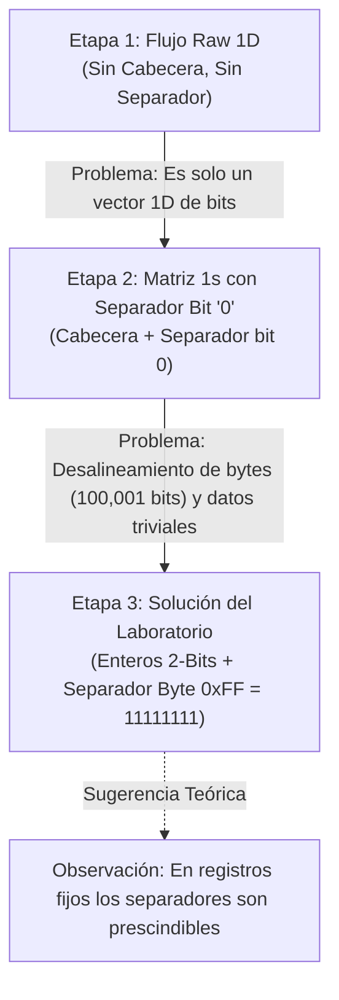

# Bitácora de Solución: Evolución de Diseño, Variantes y Fundamentos Técnicos

**Asignatura:** Estructuras de Datos  
**Laboratorio 1:** Matriz de 100,000 x 100,000 en Almacenamiento Secundario (Disco Duro)  
**Documento:** Bitácora Técnica y Análisis de Variantes de Implementación  
**Estudiante:** Emanuel Lopez Franco

---

## 1. Introducción y Propósito de la Bitácora

Esta bitácora documenta el proceso investigativo, experimental y de diseño de ingeniería recorrido para resolver el almacenamiento y manipulación eficiente de una matriz de **100,000 x 100,000** celdas (10,000,000,000 de elementos en total) en disco duro.

A lo largo del desarrollo se exploraron distintas hipótesis sobre la necesidad de cabeceras, delimitadores de fila y codificaciones de bits, enfrentando problemas de colisión semántica, desalineamiento de memoria y sobrecostos de I/O hasta converger en la **Solución Definitiva de Alto Rendimiento**.

---

## 2. Evolución Cronológica y Variantes de Solución en Python



---

### Etapa 1: Variante Raw sin Cabecera ni Separadores
> **Script implementado:** [`variante1_sin_header_sin_separador.py`](../solucion_python/variante1_sin_header_sin_separador.py)

#### 1. ¿Por qué elegimos representación binaria (1 bit por celda)?
Para una matriz de $100,000 \times 100,000$ (10 mil millones de celdas), el tipo de dato elegido determina directamente la viabilidad del sistema:
- **Si usáramos enteros estándar (`int` de 4 bytes):** La matriz pesaría **40 GB**, colapsando la memoria RAM (*Crash / Out of Memory*) y tardando horas en escribirse a disco.
- **Si usáramos caracteres o bytes (`char` / `uint8_t` de 1 byte):** La matriz pesaría **10 GB** (10,000,000,000 bytes = ~9.31 GiB), lo cual sigue siendo excesivamente pesado para la memoria RAM típica (8 a 16 GB).
- **Elección: Representación en Bits (1 bit por celda):** Empaquetando **8 celdas en cada byte**, el tamaño total se reduce a solo **1,250,000,000 bytes (~1.16 GB / 1.25 GB)**, permitiendo procesar y transferir la matriz de manera ligera.

```text
Estructura en disco (Flujo continuo de bits, 8 celdas por byte):
[Byte 0: celdas (0,0)..(0,7)] [Byte 1: celdas (0,8)..(0,15)] ... [Byte 1,249,999,999: celdas (99999,99992)..(99999,99999)]
Tamaño total = (100,000 * 100,000) / 8 = 1,250,000,000 bytes (~1.16 GB).
```

#### 2. Ventaja: Acceso Aleatorio Directo $O(1)$
- **¿Qué es el acceso aleatorio directo?:** Es la capacidad de consultar o saltar a **cualquier celda arbitraria `(fila, columna)` de forma instantánea**, sin necesidad de leer o escanear todas las celdas anteriores.
- **¿Por qué funciona en $O(1)$?:** Como todas las celdas miden exactamente 1 bit y no hay delimitadores de tamaño variable, el procesador calcula directamente la posición física en el archivo con una operación matemática básica:
  $$\text{byte}_{\text{offset}} = \left\lfloor \frac{\text{fila} \times 100000 + \text{columna}}{8} \right\rfloor$$
  Luego, el disco salta directamente a ese byte con `seek()` y lo lee en 1 milisegundo.

#### 3. El Problema y la Caída en Cuenta (¿Por qué no bastaba?)
- **Generamos un Vector o Línea Continua de Bits:** Al analizar el resultado, nos dimos cuenta de que lo que habíamos guardado físicamente en el disco era simplemente una **tira/vector lineal plano de 10 mil millones de bits continuos** en vez de una matriz.
- **No cumplía formalmente con la definición de Matriz en archivo:** En el archivo no existía ninguna cabecera que dijera cuántas filas o columnas tenía, ni marcas de fin de fila que delimitaran su estructura bidimensional. Esto nos hizo concluir que necesitábamos estructurar el archivo con un *header* y separadores para que cumpliera formalmente con la definición de matriz.

---

### Etapa 2: Variante con Matriz Llena de Bits '1', Cabecera y Separador de Fila con Bit '0'
> **Script implementado:** [`variante2_separador_cero.py`](../solucion_python/variante2_separador_cero.py)

#### Hipótesis y Motivación del Experimento
Tras darnos cuenta de que la Variante 1 era solo un vector lineal de bits sin estructura bidimensional intrínseca en el archivo, se concluyó que para entrar en la definición formal de matriz se requerían dos elementos indispensables:
1. **Una Cabecera (*Header*):** 16 bytes iniciales que declaran las dimensiones `(FILAS, COLUMNAS)`.
2. **Un Separador de Fila:** Un delimitador al final de cada fila que marque físicamente la frontera entre filas en el disco.

Como en las indicaciones originales del laboratorio el docente **no especificó con qué valores exactos debía llenarse la matriz** (solo requería escribir una matriz de 100,000 x 100,000 en disco y mostrarla), y dado que estábamos trabajando a nivel de bits, se diseñó la siguiente solución:
- **Relleno de celdas:** Cada celda de la matriz se llenó con el **bit `1`** (100,000 bits en 1).
- **Separador de fin de fila:** Al terminar cada fila, se colocó **un bit `0`** exclusivamente como separador/delimitador de fila.

```text
Estructura lógica de una fila en la Variante 2:
[ 100,000 bits con valor '1' (Datos) ] + [ 1 bit con valor '0' (Separador de fila) ]
Total por fila = 100,001 bits.
```

#### La Caída en Cuenta: ¿Por qué nos dimos cuenta de que NO tenía sentido?
Al evaluar la implementación física, descubrimos dos fallas críticas insalvables:

1. **Ruptura Total del Alineamiento de Bytes (*Bit-Boundary Hazard*):**
   - Una fila con 100,001 bits **no es divisible entre 8** ($100,001 / 8 = 12,500.125\text{ bytes}$).
   - Esto significa que la Fila 0 termina en el bit 0 del byte 12,500; por lo tanto, la Fila 1 comienza en el **bit 1** de ese mismo byte; la Fila 2 comenzaría en el **bit 2** del byte 25,000, y así sucesivamente.
   - Cada fila queda desfasada respecto a la frontera de bytes, destruyendo la posibilidad de calcular desplazamientos limpios y convirtiendo el acceso a disco en una pesadilla de corrimientos de bits inter-byte.
   - *(Incluso si se intentara parchar inflando el separador a un byte completo `0x00` para alinear a 12,501 bytes, persistía el segundo problema).*

2. **Matriz Trivial y Colisión Absoluta de Datos:**
   - Para que el bit `0` pudiera servir como separador inequívoco, estábamos obligados a que todas las celdas fueran `1`.
   - En el momento en que se deseara almacenar una matriz real con ceros y unos simultáneamente, un dato `0` y un separador `0` son **físicamente idénticos e indistinguibles**.

#### La Transición a la Etapa 3:
Darnos cuenta de que esta aproximación carecía de sentido nos obligó a plantear dos requisitos indispensables:
- Necesitamos soportar datos reales con múltiples valores (no solo una matriz trivial de 1s).
- El separador debe ser un valor de control reservado que nunca colisione con los datos y que respete la alineación de bytes.
Esto nos llevó directamente a la **Etapa 3: enteros de 2 bits (valores del 0 al 2) con un separador de fin de fila de un byte entero `11111111` (`0xFF`)**.

---

### Etapa 3: Variante con Enteros de 2 Bits (Valores 0 a 2) y Separador de 1 Byte `0xFF` (`11111111`)
> **Script implementado:** [`variante3_int2bits_separador_byte.py`](../solucion_python/variante3_int2bits_separador_byte.py)

#### Hipótesis y Solución Planteada
Para resolver la colisión semántica de la Variante 2 sin perder variedad de datos:
1. Se definió un sistema de **enteros de 2 bits** por celda, permitiendo 3 estados posibles:
   - `00` en binario = valor `0`
   - `01` en binario = valor `1`
   - `10` en binario = valor `2`
   - (`11` queda reservado como valor centinela / control).
2. Se empaquetan **4 celdas por byte** ($100,000 / 4 = 25,000\text{ bytes de datos por fila}$).
3. Al final de cada fila se escribe un byte separador centinela con valor `0xFF` (`11111111` en binario = 255). Dado que ningún grupo de datos genera el patrón `0xFF` (o al estar delimitado al final del bloque), el separador es 100% inequívoco.
4. Se implementó una **Cabecera Estándar HDF5 de 64 bytes**: Inicia con la firma canónica de HDF5 (`\x89HDF\r\n\x1a\n`), versión de superbloque, metadatos estructurados y dimensiones en enteros de 64 bits (`uint64_t`), alineada con la línea de caché del procesador.

```text
Estructura física de una fila en la Variante 3:
+-------------------------------------------------------+---------------------+
| 25,000 bytes de datos (4 celdas de 2-bits por byte)   | 1 byte Separador    |
| Valores posibles: 0, 1, 2                             | Valor: 0xFF (255)   |
+-------------------------------------------------------+---------------------+
Tamaño total por fila = 25,001 bytes.
Tamaño total en disco = 64 bytes Cabecera HDF5 + 100,000 * 25,001 = 2,500,100,064 bytes (~2.33 GB).
```

#### Conclusión y Adopción como Solución del Laboratorio
La **Etapa 3** resuelve de manera integral todos los requisitos solicitados:
1. **Archivo Autodescriptivo con Estándar HDF5:** Cabecera de 64 bytes con firma mágica `\x89HDF\r\n\x1a\n` y dimensiones `(FILAS, COLUMNAS)`.
2. **Valores Múltiples:** Celdas capaces de almacenar valores del 0 al 2 sin restricción unaria.
3. **Separador Inequívoco y Alineado:** Un byte entero `0xFF` (`11111111` = 255) al final de cada fila que delimita formalmente la fila y respeta la frontera de bytes ($25,001\text{ bytes por fila}$).
4. **Implementación Completa:** Esta es la arquitectura desarrollada en los programas principales de [`solucion_cpp/`](../solucion_cpp/crear_matriz.cpp) y [`solucion_python/`](../solucion_python/generar_matriz.py).

---

### Observación y Sugerencia Teórica: Principio de Registros de Tamaño Fijo (*Fixed-Length Records*)

A nivel teórico y de ingeniería de software avanzada (particularmente en **Sistemas de Bases de Datos** como PostgreSQL, MySQL InnoDB y sistemas de archivos de SO):

- **¿Cuándo se necesitan separadores?:**  
  En literatura canónica (*Database System Concepts* de Silberschatz, Korth y Sudarshan), los separadores (`\n`, comas, bytes centinela) o tablas de punteros (*slotted pages*) son necesarios únicamente en **registros de longitud variable** (`VARCHAR`, `TEXT`, CSV), donde el tamaño de cada fila es impredecible.
- **¿Qué ocurre en registros de longitud fija?:**  
  Cuando todas las filas miden exactamente la misma cantidad de bytes (en este caso, 25,000 bytes de datos), la dirección de cualquier fila $i$ y celda $(i, j)$ es **puramente algebraica**:
  $$\text{offset} = \text{CABECERA}_{\text{HDF5}} + (i \times \text{ANCHO}_{\text{TOTAL}}) + \left\lfloor \frac{j}{4} \right\rfloor$$
- **Sugerencia Teórica:**  
  Bajo este principio, en un sistema de producción masivo los separadores de fila podrían omitirse para ahorrar espacio adicional sin perder el acceso aleatorio $O(1)$. No obstante, para satisfacer el objetivo pedagógico del laboratorio de contar con un **delimitador explícito de fin de fila**, la implementación adopta el byte centinela `11111111` (`0xFF`).

---

## 3. Matriz Comparativa de las Variantes

| Métrica / Característica | Variante 1 (Raw) | Variante 2 (Matriz 1s + Sep bit 0) | Etapa 3 (Solución del Lab: HDF5 + 2-Bits + Sep 0xFF) |
| :--- | :--- | :--- | :--- |
| **Cabecera (Header)** | No (0 bytes) | Sí (16 bytes básicos) | **Sí (64 bytes estándar HDF5 con firma mágica)** |
| **Valores Soportados** | Bits (0..1) | Solo valor `1` constante | **Enteros en rango [0..2]** |
| **Bits por Celda** | 1 bit | 1 bit | **2 bits (4 celdas/byte)** |
| **Separador de Fila** | Ninguno | 1 bit `0` (100,001 bits/fila) | **1 byte entero `11111111` (0xFF)** |
| **Alineamiento de Bytes** | Alineado (12,500 B) | **Roto (12,500.125 B)** | **Alineado (25,001 B por fila)** |
| **Tamaño Total en Disco** | 1,250,000,000 B | ~12.5 MB (muestra) | **2,500,100,064 B (~2.33 GB)** |
| **Flexibilidad de Datos** | Tira continua de bits | **Nula (restringida a 1s)** | **Completa (valores 0, 1 y 2)** |
| **Complejidad de Acceso** | $O(1)$ directo | Compleja por desfase de bits | **$O(1)$ Direct Offset con Stride de 25,001 B** |
| **Estado en el Proyecto** | Descartada (Vector 1D) | Descartada (Inviable) | **Implementación Oficial del Laboratorio** |

---

## 4. Resolución Formal de los 3 Desafíos del Laboratorio

### Desafío 1: Consumo Excesivo de Memoria RAM
- **Problema:** Alojar la matriz de 10 mil millones de celdas completa en RAM requeriría:
  - Tipo `int` (4 bytes): $100,000 \times 100,000 \times 4\text{ B} = \mathbf{40\text{ GB}}$.
  - Tipo `uint8_t` (1 byte): $100,000 \times 100,000 \times 1\text{ B} = \mathbf{10\text{ GB}}$.
  En cualquier computadora personal provocaría un fallo inmediato por falta de memoria (*Out of Memory / Crash*).
- **Solución Implementada:**
  1. **La matriz NUNCA se crea completa en RAM:** Se genera y escribe progresivamente por bloques/páginas de ~12.5 MB directamente a disco (*Out-of-Core Processing*), liberando la memoria a medida que avanza.
  2. **TAMPOCO se carga completa en RAM al consultarse:** Para leer celdas o submatrices, se utiliza *Demand Paging* mediante saltos directos $O(1)$ con `seekg` o desplazamientos de archivo, cargando únicamente el byte específico requerido desde el disco sin transferir el resto del archivo a memoria.
  3. **Empaquetamiento a nivel de bits:** Se compactan múltiples celdas por byte (4 celdas/byte en 2 bits, u 8 celdas/byte en 1 bit).
  La memoria RAM ocupada en todo momento nunca supera los **~15 a 20 MB**.

---

### Desafío 2: Escritura Lenta a Disco Duro
- **Problema:** Escribir celda por celda o byte por byte genera mil millones de llamadas al sistema (*syscalls*), provocando que la generación tarde varias horas debido a la sobrecarga de cambios de contexto entre modo usuario y modo kernel.
- **Solución:**
  - **Buffered Chunked I/O:** Se transfieren bloques completos contiguos de **12.5 MB** en una sola invocación de `write()` o `tofile()`:
    $$\text{Total operaciones I/O} = \frac{100,000\text{ filas}}{1,000\text{ filas por chunk}} = \mathbf{100\text{ escrituras a disco}}.$$
  - Esto aprovecha al 100% el ancho de banda de escritura secuencial del disco (SSD/HDD), completando la generación en pocos segundos.

---

### Desafío 3: Optimización en la Manipulación, Creación, Almacenamiento y Lectura
- **Problema:** Si el archivo contuviera separadores o se leyera secuencialmente para buscar una coordenada $(i, j)$, el costo sería de tiempo lineal $O(N)$.
- **Solución:**
  - **Row-Major Direct Offset $O(1)$:** Cualquier celda se ubica instantáneamente mediante una operación aritmética:
    $$\text{Índice Lineal de Bits} = \text{fila} \times 100000 + \text{columna}$$
    $$\text{Offset en Disco} = 16 + \left\lfloor \frac{\text{Índice Lineal de Bits}}{8} \right\rfloor$$
  - **Demand Paging:** La consulta con `archivo.seekg(offset)` hace que el sistema operativo transfiera únicamente el byte/sector requerido desde el disco a la memoria caché, sin tocar el resto del archivo de 1.25 GB.

---

## 5. Fundamento Teórico: ¿Qué define formalmente a una Matriz en Computación?

| Componente | ¿Es indispensable para ser matriz? | Explicación Técnica |
| :--- | :--- | :--- |
| **Fórmula de Indexación (Row-Major Stride)** | **SÍ (Esencial)** | Conecta las coordenadas lógicas 2D `(fila, columna)` con la memoria lineal 1D en tiempo $O(1)$. Sin esta función de mapeo no existe matriz. |
| **Cabecera (Header de Metadatos)** | **Recomendado** | Permite que el archivo sea autodescriptivo guardando `(FILAS, COLUMNAS)`. |
| **Separadores de Fila (`\n`, comas, marcadores)** | **NO (Perjudicial)** | Son innecesarios en matrices densas y destruyen el acceso aleatorio $O(1)$. Solo se utilizan en formatos de texto humano (CSV) o en matrices de registros variables. |
| **Tabla de Punteros / Offsets** | **NO (Redundante)** | Solo se justifica en estructuras dispersas (*CSR/CSC*) o de longitud irregular. En matrices regulares, la dirección es calculable matemáticamente. |

---

## 6. Herramientas de Inspección y Verificación de Bajo Nivel

Para validar la composición binaria exacta del archivo generado desde la consola del sistema:

### En Windows PowerShell:
```powershell
# Inspeccionar los primeros 32 bytes (16 bytes de Header + primeros 16 bytes de datos)
Get-Content -Path .\matriz_100k.bin -Encoding Byte -TotalCount 32 | Format-Hex
```

### En Linux / Git Bash:
```bash
# Ver los primeros 16 bytes en binario puro (0s y 1s reales)
xxd -b -l 16 matriz_100k.bin

# Ver la cabecera y primeros datos en formato hexadecimal
hexdump -C -n 32 matriz_100k.bin
```
